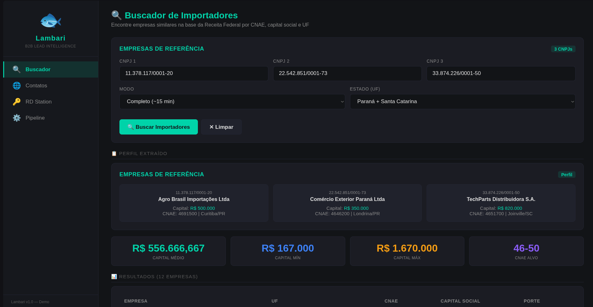
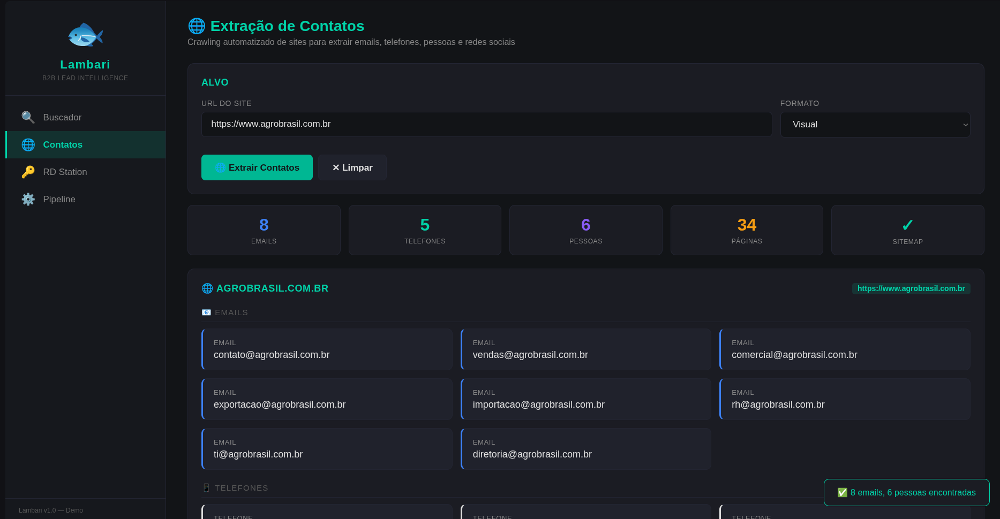
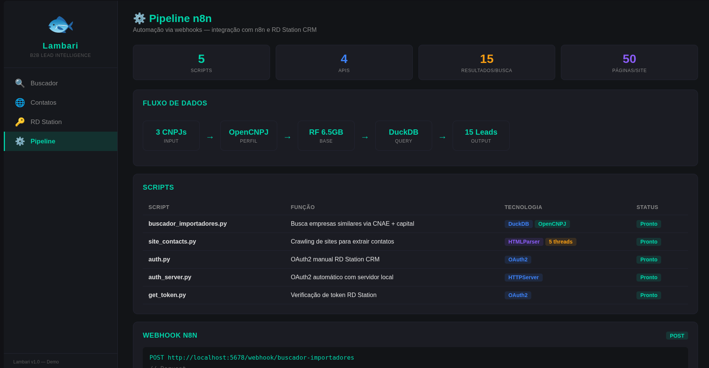
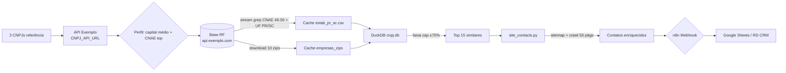

# Lambari

[](https://github.com/PIRANGUEIRO/lambari/actions)    

> Gerador de leads B2B — encontra importadores similares em PR/SC a partir de CNPJs de referência usando dados abertos da Receita Federal + enriquecimento de contatos via crawl.

> 🚧 **Projeto em desenvolvimento (WIP) — não está finalizado**  
> Pipeline funcional em modo demo (prints em `docs/images/`, APIs `api.exemplo.com` mock), mas sem testes automatizados, sem parametrização completa de UF/CNAE e sem deploy em produção. Uso real requer configurar `.env` com endpoints reais e validar resultados. Veja `## Limitations` e `## Roadmap`.

## Overview

### Contexto

Operações de comércio exterior em PR/SC dependem de prospecção B2B contínua, mas o mercado é fragmentado: importadores estão dispersos em contribuições CNAE 46–50, com portes e capitais muito distintos, e não existe uma base pronta de "empresas similares a meus melhores clientes". A Receita Federal publica a base completa (Estabelecimentos + Empresas, ~6.5GB compactado, +50M linhas), mas ela é intrinsecamente não filtrável: encoding ISO-8859-1, pipe-separated sem header, 10 arquivos .zip de ~540MB cada, e sem API oficial para queries por similaridade. Cruzar essa base manualmente é inviável, e mesmo encontrando CNPJs, falta o contato decisivo (e-mail, telefone, pessoa, LinkedIn) que normalmente está apenas disperso no site institucional.

### Problema

Como, a partir de 3 CNPJs de referência (clientes ideais, concorrentes ou parceiros), gerar uma lista curta, ranqueada e acionável de importadores similares no mesmo território (PR/SC) e no mesmo perfil econômico (faixa de capital), já enriquecida com contatos extraídos automaticamente dos sites — de forma reprodutível, cacheável e integrável a CRM/Sheets sem trabalho manual?

### Solução

O **Lambari** resolve com um pipeline em duas etapas, desenhado para ser eficiente em disco/RAM e tolerante a falhas, orquestrado via **n8n workflow** (`bnsuP7NDtBvl8HU9` → `POST /webhook/buscador-importadores`) e alimentando o pipeline **BotCotation → Google Sheets / RD Station CRM**:

**1. Buscador (`src/buscador_importadores.py:121`) — Similaridade por perfil econômico**
- Consulta os 3 CNPJs de referência na API mock (`CNPJ_API_URL` → `https://api.exemplo.com/cnpj/{}`) e extrai `capital_social`, `cnae_principal`, `uf/município` e `porte`.
- Calcula **perfil**: capital médio, faixa `0.3×–3.0×` (ajustável via `CAP_MIN_FATOR`/`CAP_MAX_FATOR`), e CNAE alvo (moda dos 2 dígitos).
- Baixa e filtra a base RF em streaming: `curl | funzip | iconv | grep -E CNAE 46-50 | grep -E UF PR|SC` — persiste apenas `estab_pr_sc.csv` (resume-safe, `Ctrl+C` preserva progresso) + 10 zips de `Empresas` em `~/.cache/cnpj_rfb/`.
- Constrói **DuckDB local** (`cnpj.db`, `SET threads=4`, `memory_limit='2GB'`, índices em `cnpj_basico`) e executa busca SQL + filtro de capital em Python, retornando **Top 15** ranqueados por capital (`src/buscador_importadores.py:345`).

**2. Enriquecimento (`src/site_contacts.py:544`) — Crawling inteligente**
- Para cada lead, tenta `sitemap.xml` → fila prioritária (contato, sobre, equipe, etc. — 28 caminhos) → crawl paralelo (`ThreadPoolExecutor 5`, `MAX_PAGINAS=50`, `TIMEOUT=6s`).
- `PageParser` ( `HTMLParser` + regex) extrai e-mails, telefones BR (com e sem formatação), nomes de pessoas (via `PRIMEIROS_NOMES` + `SOBRENOMES_COMUNS`), cargos, CNPJs, e redes sociais (LinkedIn company/pessoa, Instagram, Facebook, YouTube, WhatsApp, Telegram), com heurísticas para evitar falsos positivos (cidades, jargão logístico, navegação).
- Consulta CNPJ encontrado na API mock e retorna `Resultado` tipado (`@dataclass`) com `paginas_visitadas`, `sitemap_usado` e listas normalizadas — pronto para webhook.

**Resultado:** de 3 CNPJs → 12–15 leads similares em PR/SC na mesma ordem de grandeza de capital, cada um já com site varrido e contatos prontos para abordagem — sem planilha manual, sem polling, e com cache local reutilizável entre execuções.

## Demo

Interface web demo (Lambari B2B Lead Intelligence):

### Buscador — 3 CNPJs → perfil + Top 15 similares


### Extração de Contatos — 8 e-mails / 5 telefones / 6 pessoas em 34 páginas


### Pipeline n8n — 3 → 15 leads via DuckDB


```bash
# 1. Perfil apenas (sem baixar 6.5GB) — resposta instantânea
python -m src.buscador_importadores --profile 11378117000120 33000167000101 27865757000102

# 2. Busca rápida (2 arquivos ~1GB)
python -m src.buscador_importadores --shallow 2 11378117000120 33000167000101 27865757000102

# 3. Busca completa (10 arquivos)
python -m src.buscador_importadores 11378117000120 33000167000101 27865757000102

# 4. Enriquecimento de site
python -m src.site_contacts https://exemplo.com.br --json > lead.json
```

Saída do buscador (CLI):
```
======================================================================
  EMPRESAS DE REFERENCIA
======================================================================
1. 11.378.117/0001-20
   Razao: EXEMPLO IMPORTACAO LTDA
   Local: Curitiba/PR
   CNAE:  4693100
   Cap:   R$ 500.000,00

======================================================================
  IMPORTADORES SIMILARES PR/SC (15)
======================================================================
1. 12.345.678/0001-90
   Razao: ALVO LOGISTICA LTDA
   Local: Itajai/SC
   CNAE:  4681805
   Cap:   R$ 420.000,00
```

## Features

- ✅ Perfil automático via OpenCNPJ (sem chave)
- ✅ Filtro streaming da base RF (curl + funzip + grep — não carrega 6.5GB em RAM)
- ✅ Cache local `~/.cache/cnpj_rfb/` com resume (Ctrl+C seguro)
- ✅ DuckDB local com índices para busca sub-segundo
- ✅ Crawl inteligente: sitemap.xml prioritário + 28 caminhos de contato + paralelismo (5 threads)
- ✅ Extração de e-mails, telefones (BR), nomes de pessoas, cargos, CNPJ, LinkedIn/Instagram/Facebook/YouTube/WhatsApp/Telegram
- ✅ Integração n8n via webhook `POST /webhook/buscador-importadores`
- ✅ Modo `--db-url` para usar DuckDB pré-construído (evita download)

## Architecture



**Componentes:** `src/buscador_importadores.py:121` (perfil), `src/buscador_importadores.py:211` (stream), `src/buscador_importadores.py:268` (DuckDB), `src/buscador_importadores.py:345` (busca), `src/site_contacts.py:544` (crawler), `src/auth/` (OAuth RD Station). Ver `docs/architecture.md` para detalhes.

## Tech Stack

| Camada | Tecnologia | Uso |
|--------|-----------|-----|
| Linguagem | Python 3.10+ | Scripts CLI |
| HTTP | `requests` | OpenCNPJ, download RF |
| DB | `duckdb` | Query local analítica |
| Concorrência | `concurrent.futures.ThreadPoolExecutor` | Downloads + crawl paralelo |
| Infra opcional | n8n + Docker | Orquestração webhook |
| Dados | `api.exemplo.com` (mock) — configurável via `CNPJ_API_URL` / `DADOS_RF_URL` | Fonte |

Apenas tecnologias efetivamente usadas — sem invenção.

> **Nota:** todas as URLs externas são `https://api.exemplo.com` por padrão (mock para portfólio). Aponte `CNPJ_API_URL`, `DADOS_RF_URL`, `OAUTH_DIALOG_URL`/`OAUTH_TOKEN_URL` no `.env` para usar APIs reais.

## Project Structure

```
lambari/
├── src/
│   ├── buscador_importadores.py  # Lead gen por similaridade (CNAE + capital)
│   ├── site_contacts.py          # Crawler de contatos
│   └── auth/
│       ├── auth.py               # OAuth manual (copy URL)
│       ├── auth_server.py        # OAuth com servidor local :8080
│       └── get_token.py          # Teste client_credentials
├── examples/
│   ├── example_output.json       # Saída de exemplo do buscador
│   └── site_contacts_example.json
├── docs/
│   ├── architecture.md
│   └── repository-audit.md
├── .github/workflows/ci.yml
├── .env.example
├── requirements.txt
└── README.md
```

## Installation

```bash
git clone https://github.com/PIRANGUEIRO/lambari.git
cd lambari
python -m venv .venv && source .venv/bin/activate
pip install -r requirements.txt

# Para auth RD Station (opcional)
cp .env.example .env
# edite .env — já vem com api.exemplo.com mock; aponte para APIs reais se necessário
```

**Dependências de sistema para buscador (Linux):** `curl`, `funzip` (unzip), `iconv`, `grep` — já vêm na maioria das distros. Em macOS: `brew install unzip`.

## Configuration

| Variável | Descrição | Obrigatória |
|----------|-----------|-------------|
| `RD_CLIENT_ID` | Client ID do app RD Station | apenas para `src/auth/*` |
| `RD_CLIENT_SECRET` | Client Secret | apenas para `src/auth/*` |
| `RD_REDIRECT_URL` | Callback URL (ex: `https://exemplo.com/callback` ou `http://localhost:8080/callback`) | apenas para auth |

Nunca commitar `.env` — use `.env.example`.

## Usage

### Buscador de Importadores

```bash
# Perfil instantâneo (sem download)
python -m src.buscador_importadores --profile 11378117000120 33000167000101 27865757000102

# Shallow (rápido, 1 arquivo ~3min)
python -m src.buscador_importadores --shallow 1 11378117000120 33000167000101 27865757000102

# Usando DB pré-construído (se hospedado)
python -m src.buscador_importadores --db-url https://exemplo.com/cnpj.db 11378117000120 33000167000101 27865757000102
```

Critérios de similaridade: `CNAE 46–50` + `UF PR/SC` + `situação 02 (ativa)` + `capital entre 0.3× e 3.0× a média` das referências. Ajuste `CNAE_IMP`, `CAP_MIN_FATOR`, `CAP_MAX_FATOR` e `LIMITE` em `src/buscador_importadores.py:41`.

### Extrator de Contatos

```bash
python -m src.site_contacts https://exemplo.com.br
python -m src.site_contacts exemplo.com.br --json | jq .
python -m src.site_contacts exemplo.com.br --csv > contatos.csv
```

### n8n Webhook

```bash
curl -X POST http://localhost:5678/webhook/buscador-importadores \
  -H "Content-Type: application/json" \
  -d '{"cnpjs": ["11378117000120","33000167000101","27865757000102"]}'
# => {"ok": true, "qtd": 15, "ref": [...], "res": [...]}
```

Workflow ID: `bnsuP7NDtBvl8HU9`. Ver `Anexos/Buscador de Importadores.md` no Vault para estrutura dos nodes.

## API

CLI puro — sem servidor HTTP próprio. A API é o webhook n8n. Ver `Usage > n8n Webhook` e `docs/architecture.md`.

## Testing

Nível atual: **0 — sem testes** (documentado honestamente). Roadmap prevê testes unitários para `limpar_cnpj`, `parse_capital`, `parece_nome_pessoa` e integração para o pipeline DuckDB (ver `docs/repository-audit.md`).

```bash
# Verificação de estilo (CI roda isto)
python -m py_compile src/buscador_importadores.py src/site_contacts.py
```

## Technical Decisions

| Decisão | Motivo | Alternativa | Trade-off |
|---------|--------|-------------|-----------|
| DuckDB local | Query analítica sem servidor, zero-ops | PostgreSQL, SQLite | Requer build local do DB (6.5GB) |
| `curl|funzip|grep` streaming | Filtrar 540MB/arquivo sem RAM | Python `zipfile` puro | Depende de binários Unix |
| `ThreadPoolExecutor(3)` download | Paralelismo controlado | serial | Mais rápido, mas pode sobrecarregar rede |
| `requests` + `urllib` híbrido | `requests` para APIs JSON, `urllib` para crawl sem dependência extra | tudo `requests` | Leve inconsistência |
| `ssl.CERT_NONE` no crawl | Tolerância a sites com cert inválido | falhar | Menos seguro, mais cobertura |
| Cache `~/.cache/cnpj_rfb` | Resume-safe, reutilizável entre execuções | `/tmp` | Ocupa disco até limpeza manual |

## Limitations

- Sem testes automatizados
- `site_contacts` usa heurística de nomes (falso-positivo possível) — ver `RE_NOME`, `PRIMEIROS_NOMES`
- DuckDB precisa ser reconstruído quando a base RF atualiza (`LATEST = 2026-05-10`)
- ReceitaWS (`site_contacts.py:415`) tem rate limit não documentado
- `auth/` exige app registrado no RD Station — secrets nunca commitados
- Buscador foca apenas PR/SC e CNAE 46–50 — generalizar exige parametrização

## Roadmap

- [ ] Parametrizar UF/CNAE/faixa via CLI (`--uf PR,SC --cnae 46-50`)
- [ ] Testes unitários (`pytest`) para parsing e filtros
- [ ] `pyproject.toml` + `ruff` + `mypy`
- [ ] Docker para execução reprodutível sem `curl/funzip`
- [ ] Export JSON/CSV nativo no buscador (hoje só stdout)
- [ ] Normalização de telefone para E.164

## License

MIT — ver `LICENSE`.

## What this project demonstrates

- Python (CLI, stdlib, concorrência, typing)
- Data Engineering (streaming de 6.5GB, DuckDB, ETL)
- Web Scraping / OSINT (sitemap parsing, HTML crawling, regex, heurísticas)
- API Integration (OpenCNPJ, RD Station OAuth, ReceitaWS, n8n webhook)
- System Design (cache, resume, índices, trade-offs documentados)
- Security (env-based secrets, .gitignore, sanitização)
