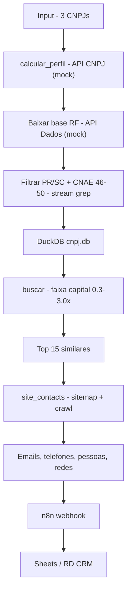

# Architecture — Lambari

## Overview

Pipeline B2B de geração e enriquecimento de leads de importadores.

## Fluxo de Dados

## Componentes

| Componente | Arquivo | Responsabilidade |
|-----------|---------|-----------------|
| Perfil | `src/buscador_importadores.py:121` | 3× OpenCNPJ, média capital, CNAE top |
| Download | `src/buscador_importadores.py:182` | ThreadPool 3, 10 zips Empresas + 10 Estabelecimentos filtrados |
| DB | `src/buscador_importadores.py:268` | DuckDB, `read_csv` com col defs, índices cnpj_basico |
| Busca | `src/buscador_importadores.py:345` | SQL regexp_matches + filtro capital em Python |
| Crawl | `src/site_contacts.py:544` | sitemap, fila prioritária, ThreadPool 5, PageParser |
| Auth | `src/auth/*` | OAuth RD Station via env vars |

## Dependências Externas

- `api.exemplo.com/cnpj/{}` (mock configurável via `CNPJ_API_URL`)
- `api.exemplo.com/dados-rf/arquivos/` (mock configurável via `DADOS_RF_URL`)
- `api.exemplo.com/oauth/*` (mock configurável via `OAUTH_*`)
> Configure via `.env` (`CNPJ_API_URL`, `DADOS_RF_URL`, `OAUTH_*`) para apontar para endpoints reais

## Persistência

- `~/.cache/cnpj_rfb/cnpj.db` — DuckDB (recriado se ausente)
- `~/.cache/cnpj_rfb/estab_pr_sc.csv` — CSV filtrado PR/SC
- `~/.cache/cnpj_rfb/empresas_zips/Empresas*.zip` — zips brutos
- `~/.rdstation_tokens.json` — tokens OAuth (gitignored)

## Tratamento de Falhas

- Download: imprime FAIL mas continua (`as_completed`)
- Stream: Ctrl+C preserva progresso (append no CSV)
- DB: se 0 estabelecimentos, remove DB e retorna None
- Crawl: `fetch` retorna None em timeout/SSL, parser ignora exceção

## Trade-offs

Ver README > Technical Decisions.
